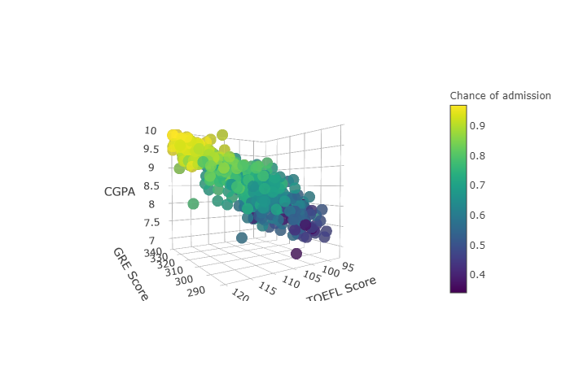
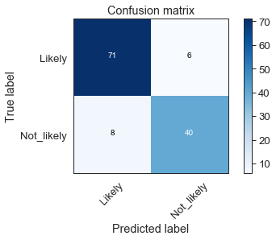

# CollabProject

* **[Master's Program Admission][1]**:

This collaborated project was aiming for developing a model to determine a liklihood of Master's Program addmission using various parameters. A threshhold of 70% chance of admit was determined based on the given data set. Based on the ***PCA and XGBoostRegressor*** analysis, the most important features were found as ***CGPA, GRE Score, and TOEFL Score***.

                  

The first model was created using the Multple Linear Regression (MLR), R-square=0.813, as we found the three most important variables to determine the addmission of the Master's Program has shown a strong correlation in linear model.

The ***Logistic Regression and SVM*** models were also used for further optimization. The accuracy of the models were found as 90% and 89% as respectviely.

                  

[1]:https://nbviewer.jupyter.org/github/kylelee417/CollabProject/blob/master/project_notebook.ipynb
